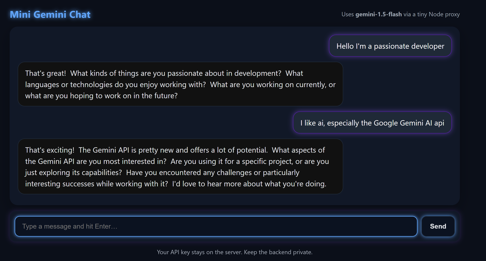

# Mini Gemini Chat

A **super simple chat app** that lets you talk to Google’s **Gemini AI**.  
This project uses a Node.js + Express backend and a very minimal HTML frontend.  
It’s designed for beginners — no complicated setup needed.

---

## 🚀 What you’ll get
- A tiny chat interface in your browser
- Messages sent safely to a Node backend
- Backend calls **Google Gemini** and sends replies back to the browser
- Your API key stays private (never exposed in the browser)


## 🛠️ Setup instructions (beginner-friendly)

### 1. Install Node.js
If you don’t have Node.js yet:
- Download it from 👉 [https://nodejs.org/](https://nodejs.org/)
- Install the **LTS version** (the one marked “Recommended for most”)

After installation, check:
```bash
node -v
npm -v
```
Both should print a version number.

---

### 2. Download this project
Clone or download/unzip this repo, then open a terminal and go inside:
```bash
cd mini-gemini-chat
```

---

### 3. Install dependencies
Run:
```bash
npm install
```

This installs the libraries the project needs (Express, dotenv, Gemini SDK, etc).

---

### 4. Get your **Gemini API key**
1. Go to 👉 [https://aistudio.google.com/](https://aistudio.google.com/)  
2. Sign in with your Google account  
3. In the top right, click your profile picture and choose **Get API key**  
4. Create a new key (free quota available!)  
5. Copy the long string of letters/numbers — that’s your **API key**

---

### 5. Add your API key
Inside this folder, copy `.env.example` to `.env`:
```bash
cp .env.example .env
```

Then open `.env` in a text editor and paste your key:
```
GEMINI_API_KEY=your_real_key_here
```

---

### 6. Run the app
Start the server:
```bash
npm run dev
```

If successful, you’ll see:
```
Mini Gemini chat listening on http://localhost:3000
```

Open 👉 [http://localhost:3000](http://localhost:3000) in your browser.  
You now have a working **chat with Gemini** 🎉

---

## 📂 Project structure
- `server.mjs` → Node.js server (keeps your API key safe)
- `public/index.html` → very small chat UI
- `public/styles.css` → optional CSS for glowing neon theme
- `.env.example` → file where you store your API key (rename to `.env`)
- `package.json` → project settings & dependencies
- `README.md` → this guide

---

## 💡 Tips
- Don’t share your `.env` file (it has your private key).
- You can change the model in `server.mjs` from `"gemini-1.5-flash"` to `"gemini-1.5-pro"` for better quality (slower, higher quota usage).
- This project is intentionally **minimal** — you can later expand it with React, streaming, or a database.

---

# 📊 Project Report

This section documents the findings from a review of the **mini-gemini-chat** repo.

### 🧐 What’s in the repo
- MIT license.  
- Key files/folders:  
  - `README.md` — instructions & user guide.  
  - `.env` (likely a placeholder).  
  - `gemini.png` — a logo/graphic.  
  - `package.json`, `package-lock.json` — dependencies.  
  - `server.mjs` — backend server.  
  - `public/` — includes `index.html`, styling, frontend.  
- Written mainly in HTML, CSS, JavaScript.  
- README already includes beginner-friendly setup instructions.  

### 👍 Strengths
- Clear guidance for beginners.  
- Protects API key with `.env`.  
- Minimalist design → easy to understand and extend.  
- Logo image (`gemini.png`) adds branding.  

## ✅ You’re ready!
Now you have your **own Gemini chatbot** running locally.  
Type messages in the input box and Gemini will respond.
